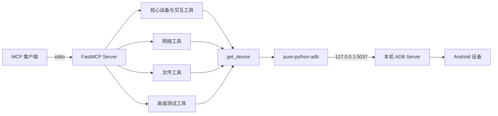

# AGENTS.md

## 项目概述

这个仓库属于一个轻量、单进程的 ADB MCP 适配层。它没有业务服务层或持久化层，核心职责是把 MCP Tool 调用翻译成 Android shell、push、pull、install 等 ADB 操作。




**启动与通信**

入口配置在 [mcp_config.json](D:/adb_mcp_server/mcp_config.json)，执行：

```
python -m src.adb_server
```

服务实例在 [adb_server.py (line 11)](D:/adb_mcp_server/src/adb_server.py:11) 创建：

```
mcp = FastMCP("android_adb")
```

最后通过 [adb_server.py (line 511)](D:/adb_mcp_server/src/adb_server.py:511) 的 `mcp.run(transport="stdio")` 启动。因此它是标准输入/输出型 MCP 服务，不监听 HTTP 端口。

**模块划分**

| 模块                                                         | 职责                                                         | 工具数 |
| ------------------------------------------------------------ | ------------------------------------------------------------ | ------ |
| [adb_server.py (line 18)](D:/adb_mcp_server/src/adb_server.py:18) | MCP 实例、设备发现、点击滑动、输入、应用控制、设备信息、截图录屏 | 24     |
| [network_tools.py (line 5)](D:/adb_mcp_server/src/network_tools.py:5) | Wi-Fi、移动数据、飞行模式、IP、Ping                          | 6      |
| [file_tools.py (line 8)](D:/adb_mcp_server/src/file_tools.py:8) | 文件浏览、push/pull、读写、下载、删除、建目录                | 8      |
| [advanced_tools.py (line 9)](D:/adb_mcp_server/src/advanced_tools.py:9) | APK、UI 自动化、日志、性能分析、录屏、增强启动               | 10     |

理论上一共有 **48 个 MCP 工具**。

所有扩展模块都从 `adb_server` 导入两个共享对象：

```
from .adb_server import get_device, mcp
```

所以 `adb_server.py` 同时承担了：

- Composition Root
- MCP Server 定义
- ADB Client Factory
- Device Resolver
- 核心工具集合

**核心调用链**

一次普通调用基本都是：

```
MCP Tool
  -> get_device(device_id)
  -> AdbClient(host="127.0.0.1", port=5037)
  -> client.devices()
  -> 选择指定设备或第一个设备
  -> device.shell() / push() / pull() / install()
  -> 返回中文字符串
```

设备没有指定时会静默选择第一个设备，相关逻辑在 [adb_server.py (line 23)](D:/adb_mcp_server/src/adb_server.py:23)。

工具虽然声明为 `async def`，但内部的 ADB、文件操作和 `time.sleep()` 都是同步阻塞调用。因此架构本质仍是同步执行模型；录屏、日志收集、性能分析期间会阻塞 MCP 事件循环。